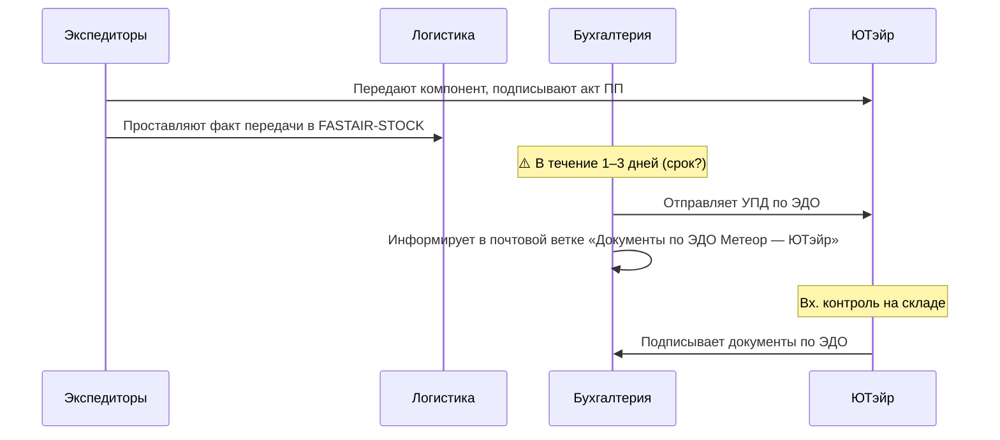
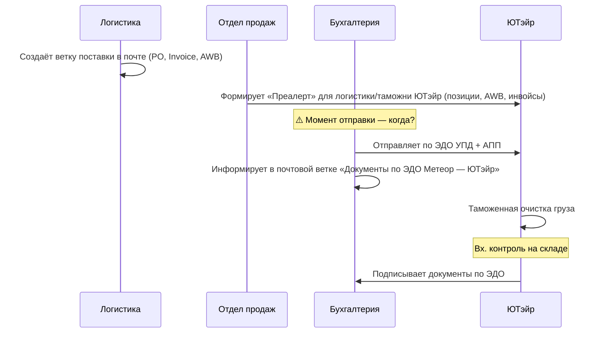
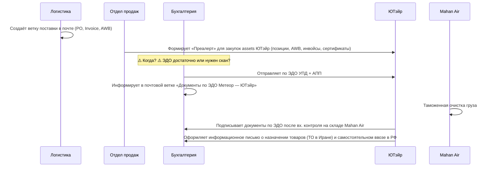
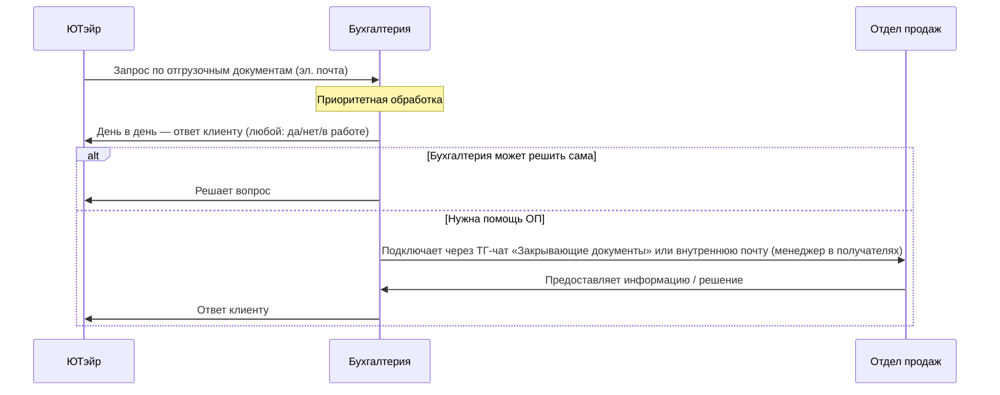

# Бизнес-процесс: отгрузочные документы (ЮТэйр)

**Статус:** рабочая версия, требует обсуждения помеченных вопросов  
**Участники:** Бухгалтерия, Отдел логистики, Отдел продаж (ОП), Клиент (ЮТэйр)  
**Контакт с клиентом:** только Бухгалтерия и ОП

---

## Общая карта

Один и тот же процесс выставления отгрузочных документов, но **четыре сценария** в зависимости от схемы поставки:

| Сценарий | Маршрут | Кто растамаживает | Особенности |
|---|---|---|---|
| [С1. DDP MOW](#с1-ddp-mow) | Доставка до Москвы, пошлины оплачены | Мы (Метеор) | Экспедиторы передают и подписывают акт ПП |
| [С2. DAT MOW](#с2-dat-mow) | Доставка до терминала Москва | ЮТэйр | ОП формирует преалерт для логистики/таможни ЮТэйр |
| [С3. DAT IKA](#с3-dat-ika) | Доставка до терминала Тегеран (Иран) | Mahan Air (для ЮТэйр) | Дополнительно: информационное письмо о назначении товаров |
| [С4. Входящее письмо ЮТэйр](#с4-входящее-письмо-от-ютэйр) | Любой | — | Реакция на запрос клиента по документам |

---

## С1. DDP MOW

> **DDP (Delivered Duty Paid) Москва** — мы доставляем, мы растамаживаем, мы передаём на месте.

### Шаги

| # | Кто | Действие |
|---|---|---|
| 1 | Экспедиторы | Передают компонент клиенту и подписывают **акт ПП** |
| 2 | Экспедиторы | Проставляют факт передачи в таблице **FASTAIR-STOCK** |
| 3 | Бухгалтерия | В течение **1–3 дней** ⚠️ отправляет по ЭДО **УПД** и информирует в почтовой ветке «Документы по ЭДО ООО «Метеор» — ПАО «Авиакомпания «ЮТэйр»» |
| 4 | ЮТэйр | Подписывает документы по ЭДО **после** завершения входного контроля на складе |

### Требует обсуждения

| Вопрос | Пояснение |
|---|---|
| ⚠️ **Срок выставления УПД: 1–3 дня — точный?** | В документе стоит знак вопроса. Нужно зафиксировать конкретный SLA |
| ⚠️ **Получатели со стороны ЮТэйр** | Кто именно должен быть в ветке? Нужно уточнить и согласовать |
| ⚠️ **Срок выставления УПД со дня отгрузки** | Нужно согласовать с ЮТэйр |

---

## С2. DAT MOW

> **DAT (Delivered At Terminal) Москва** — мы доставляем до терминала в Москве, ЮТэйр сами растамаживают.

### Шаги

| # | Кто | Действие |
|---|---|---|
| 1 | Логистика | Создаёт в почте ветку поставки: **«Поставка EZ… Utair DAT MOSCOW»** с планируемой датой прибытия. Ветка содержит PO, Invoice, AWB |
| 2 | ОП | Формирует **«Преалерт»** для логистики/таможни ЮТэйр: **«Прибытие по AWB … Шереметьево»**. Содержит: позиции, AWB, инвойсы |
| 3 | Бухгалтерия | ⚠️ Отправляет по ЭДО **УПД + АПП** и информирует в почтовой ветке |
| 4 | ЮТэйр | Производит **таможенную очистку** груза |
| 5 | ЮТэйр | Подписывает документы по ЭДО **после** завершения вх. контроля на складе |

### Требует обсуждения

| Вопрос | Пояснение |
|---|---|
| ⚠️ **Когда бухгалтерия отправляет УПД + АПП?** | В документе прямо стоит «(когда?)» — нет зафиксированного момента. До таможенной очистки? После? Одновременно с преалертом? |

---

## С3. DAT IKA

> **DAT (Delivered At Terminal) Тегеран** — доставка до терминала в Иране. Таможенную очистку делает Mahan Air (для ЮТэйр). Самый сложный сценарий.

### Шаги

| # | Кто | Действие |
|---|---|---|
| 1 | Логистика | Создаёт ветку: **«Поставка EZ… Utair DAT TEHRAN»** с планируемой датой. PO, Invoice, AWB |
| 2 | ОП | Формирует **«Преалерт»** для **отдела закупок assets** ЮТэйр. Содержит: позиции, AWB, инвойсы, **сертификаты** |
| 3 | Бухгалтерия | ⚠️ Отправляет по ЭДО **УПД + АПП** и информирует в ветке |
| 4 | Mahan Air | Производит **таможенную очистку** груза (от имени ЮТэйр) |
| 5 | ЮТэйр | Подписывает документы по ЭДО **после** вх. контроля на складе Mahan Air |
| 6 | ЮТэйр | Оформляет в адрес Метеор **информационное письмо**: назначение товаров (ТО в Иране) и самостоятельный ввоз в РФ |

### Требует обсуждения

| Вопрос | Пояснение |
|---|---|
| ⚠️ **Когда бухгалтерия отправляет УПД + АПП?** | Тот же вопрос, что в С2 — момент не зафиксирован |
| ⚠️ **Достаточно ЭДО или нужен скан?** | В документе прямо стоит вопрос. Для Ирана формат может отличаться — уточнить с ЮТэйр |
| ⚠️ **Преалерт идёт в другой отдел** | В С2 — логистика/таможня ЮТэйр. В С3 — **закупки assets** ЮТэйр. Проверить, что адресаты актуальны |
| ⚠️ **Сертификаты в преалерте** | Только в С3 к преалерту добавляются сертификаты. Какие именно? Всегда или по запросу? |
| ⚠️ **Информационное письмо от ЮТэйр** | Нужен шаблон / ожидаемая форма? Кто его инициирует — мы просим или они сами? |

---

## С4. Входящее письмо от ЮТэйр

> Любой сценарий. ЮТэйр пишет нам по электронной почте с запросом / вопросом по документам.

### Шаги

| # | Кто | Действие |
|---|---|---|
| 1 | Бухгалтерия | Берёт в работу запросы от ЮТэйр **в приоритетном порядке** |
| 2 | Бухгалтерия | **День в день** даёт ответ клиенту в почте — вне зависимости, можно ли решить вопрос сразу или нет |
| 3 | Бухгалтерия | При необходимости подключает ОП: через ТГ-чат **«Закрывающие документы»** или внутреннюю ветку почты со счётом, **обязательно указывая менеджера в получателях** |

### Требует обсуждения

| Вопрос | Пояснение |
|---|---|
| ⚠️ **«Приоритетный порядок» — SLA?** | Что означает «приоритет»? Первый в очереди? Максимум N часов? Нужно формализовать |
| ⚠️ **«День в день» — до конца рабочего дня?** | Если письмо пришло в 17:50 — ответ сегодня или завтра? |

---

## Сравнение сценариев

| Параметр | DDP MOW | DAT MOW | DAT IKA | Письмо от ЮТэйр |
|---|---|---|---|---|
| **Логистика создаёт ветку** | — | Да | Да | — |
| **ОП делает преалерт** | — | Да (логистика/таможня ЮТэйр) | Да (закупки assets ЮТэйр) | — |
| **Кто передаёт товар** | Экспедиторы + акт ПП | — | — | — |
| **FASTAIR-STOCK** | Экспедиторы проставляют | — | — | — |
| **Бухгалтерия отправляет** | УПД | УПД + АПП | УПД + АПП ⚠️ + скан? | Ответ на запрос |
| **Кто растамаживает** | Метеор | ЮТэйр | Mahan Air | — |
| **Доп. документ от клиента** | — | — | Информационное письмо | — |
| **Сертификаты в преалерте** | — | — | Да ⚠️ | — |
| **Срок бухгалтерии** | 1–3 дня ⚠️ | Не определён ⚠️ | Не определён ⚠️ | День в день |
| **Подписание ЭДО клиентом** | После вх. контроля | После вх. контроля | После вх. контроля (склад Mahan Air) | — |

---

## Сводка: всё, что требует обсуждения

| # | Сценарий | Вопрос | Приоритет |
|---|---|---|---|
| 1 | DDP MOW | Точный срок выставления УПД (1–3 дня или иначе) | Высокий |
| 2 | DDP MOW | Получатели со стороны ЮТэйр в почтовой ветке | Средний |
| 3 | DDP MOW | Согласование срока выставления УПД со дня отгрузки | Высокий |
| 4 | DAT MOW | Когда бухгалтерия отправляет УПД + АПП | Высокий |
| 5 | DAT IKA | Когда бухгалтерия отправляет УПД + АПП | Высокий |
| 6 | DAT IKA | ЭДО достаточно или нужен скан для Ирана | Высокий |
| 7 | DAT IKA | Какие сертификаты добавляются в преалерт | Средний |
| 8 | DAT IKA | Форма/шаблон информационного письма от ЮТэйр | Средний |
| 9 | DAT IKA | Адресат преалерта (закупки assets) — актуален? | Низкий |
| 10 | Письмо ЮТэйр | Формализация SLA «приоритетного порядка» | Средний |
| 11 | Письмо ЮТэйр | Уточнить «день в день» — до конца рабочего дня? | Низкий |
| 12 | Все | FASTAIR-STOCK: только в DDP или во всех сценариях? | Средний |
| 13 | Все | Нужно ли проставлять признак Честного знака в любом из сценариев (см. методичку ЧЗ)? | Средний |

---

*Документ подготовлен на основе файла «БП отгрузочные документы.docx». Вопросы помечены ⚠️ там, где автор указал неопределённость, и дополнительно — где, по контексту, нужна доработка.*
