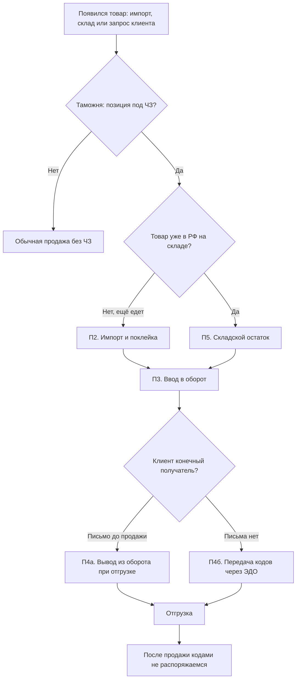
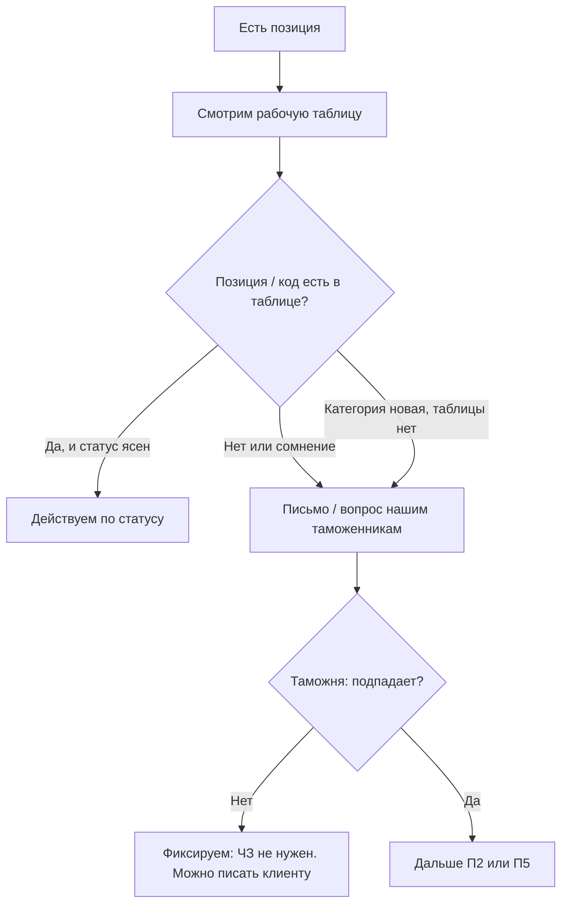
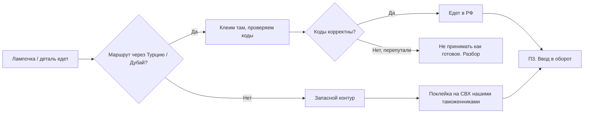
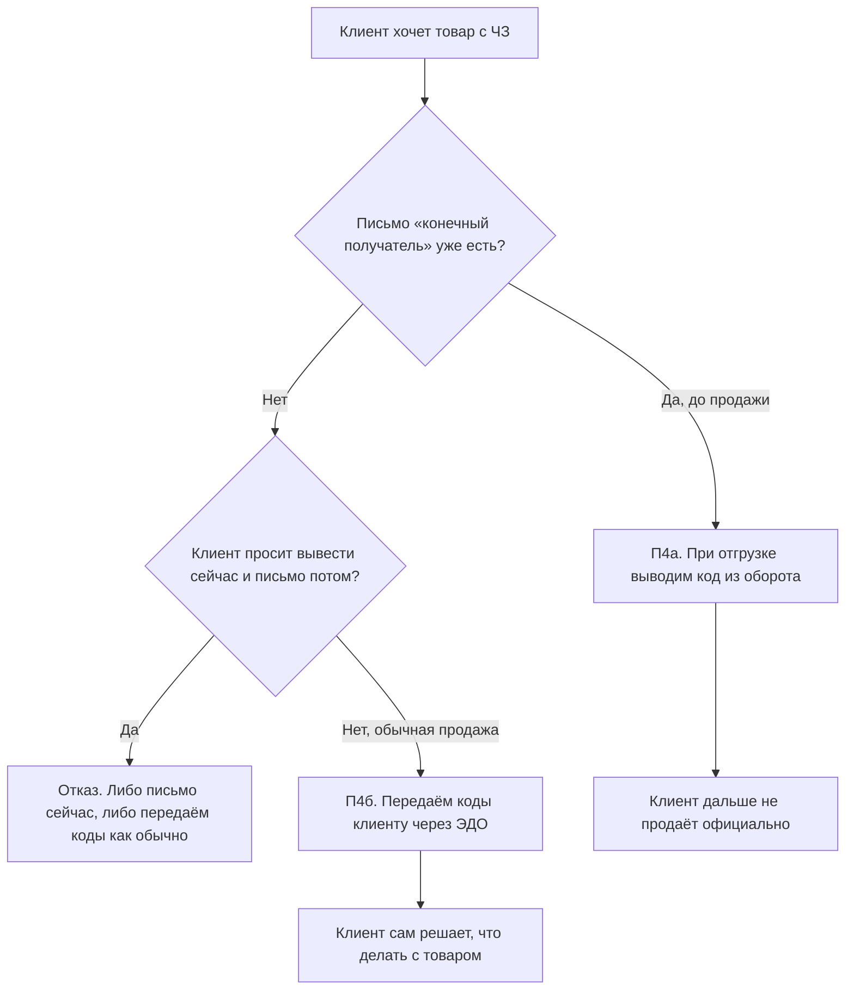
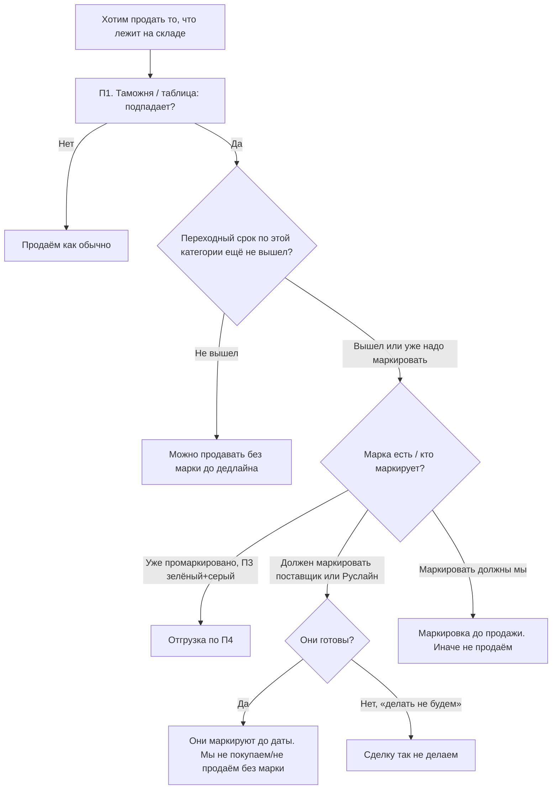

# Методичка: работа с Честным знаком

**Статус:** рабочая версия для закрепления в компании  
**Основание:** встреча 27.08.2026 (запись «Трехгорная мануфактура 2»)  
**Для кого:** продажи, логистика, таможня, склад, брокеры, Fasterstock  
**Как пользоваться:** сначала блок «10 правил», затем нужный процесс и чеклист в конце.

Документ описывает **наш** порядок работы, а не текст закона. Если закон или категория изменились — сначала таможня, потом эта методичка.

---

## 10 правил (запомнить)

1. Подпадает товар под Честный знак или нет, **окончательно говорит только таможня** (по кодам). Табличка — подсказка, не истина в последней инстанции.
2. Категории **постоянно добавляют**. Нет в таблице ≠ «не надо». Спросить таможню.
3. **Освобождения по сути нет.** Есть только переходный срок на остатки — и он свой у каждой категории.
4. Отгружать можно, когда в рабочей таблице: **строка серая** и **«введён в оборот» зелёный**.
5. Есть комментарий в строке — **не грузить**, пока не разобрали.
6. Письмо «мы конечные получатели» принимаем **только до продажи**. После продажи кодами мы уже не распоряжаемся.
7. Обычному клиенту (без письма) коды **передаём через ЭДО**. Дальше товар — его ответственность.
8. Если поставщик / **Руслайн** должен маркировать, а говорит «делать не будем» — **так не покупаем и не продаём**.
9. Не писать клиенту «Честный знак не нужен», пока таможня или таблица это не подтвердили. Не все лампы подпадают — но часть подпадает.
10. Признак Честного знака должен стоять в **Fasterstock** и у **брокеров**. Иначе ваучер / отгрузка может не пройти.

---

## 1. Зачем это нам

Честный знак — обязательная маркировка отдельных категорий товара. Если коды не получены, не введены в оборот или некорректно переданы клиенту:

- нельзя легально ввезти и отгрузить;
- складской остаток после дедлайна нельзя продать;
- клиент не сможет использовать или перепродать товар;
- появляются штрафы, простой на СВХ и лишние расходы.

Эта методичка фиксирует, **кто что делает**, **в каком порядке** и **чего нельзя**.

---

## 2. Термины

| Термин | Что это значит у нас |
|---|---|
| **Честный знак (ЧЗ)** | Гос. система маркировки. На товаре — код. По коду видно движение товара. |
| **Код / категория** | Признак, по которому таможня определяет, попал товар под ЧЗ или нет (в т.ч. ТН ВЭД). |
| **Ввод в оборот** | Мы как импортёр «включили» коды. Без этого отгрузка клиенту невозможна. |
| **Вывод из оборота** | Код больше не в гражданском обороте. Так делаем для **конечных получателей** при продаже. |
| **Передача кодов** | Для обычных клиентов: коды уходят им через ЭДО, дальше они сами. |
| **Конечный получатель** | Клиент официально письмом заявил: товар себе, дальше не продаёт. |
| **Рабочая таблица** | Служебная таблица логистов/таможни по инвойсам, кодам и контрагентам. |
| **СВХ** | Склад временного хранения в РФ. Здесь клеят марку, если не наклеили за границей. |
| **Остатки** | Товар, который уже лежит на складе, часто без марки (приехал до обязанности). |

---

## 3. Роли

| Роль | За что отвечает | Чего не делает |
|---|---|---|
| **Таможня (наши таможенники)** | Решает, подпадает ли позиция. Организует поклейку на СВХ в РФ. | Не отвечает клиентам продаж за коммерцию. |
| **Логистика** | Ведёт импорт, заранее сообщает «нужна маркировка», следит, чтобы товар не приехал «сюрпризом». | Не даёт окончательный ответ «попадает / не попадает» в обход таможни. |
| **Продажи** | Перед КП / отгрузкой проверяет таблицу или спрашивает таможню. Собирает письмо конечного получателя **до** сделки. Корректно отвечает клиенту. | Не пишет «ЧЗ не нужен» от себя. Не отправляет запрос «выведите из оборота» в бухгалтерию. |
| **Игорь / владелец таблицы** | Держит таблицу актуальной, шарит продажам **на просмотр**. | — |
| **Fasterstock (учёт)** | На приходе и отправке проставляет признак ЧЗ. | — |
| **Брокеры** | То же в своих документах. Без признака отгрузка может не пройти. | — |
| **Склад / «склад-файл»** | Видит, что лежит у нас. Пока признак ЧЗ здесь **не ведётся** — ориентир: Fasterstock + таблица. | Не является источником правды по ЧЗ. |
| **Егор** | Вносит маркируемую номенклатуру в систему. | — |
| **Бухгалтерия** | Не выводит коды из оборота после продажи. | Не «чинит» ЧЗ по просьбе клиента. |

Клиенты и партнёры, которые часто всплывают в этом контуре: **Победа**, **Метеор**, **Красная стрела**, **ЮТэйр**, **Руслайн**, поставщики вроде **Sirius**.

---

## 4. Общая карта процессов

---

## П1. Определение: нужен ли Честный знак

**Когда запускаем:** любой новый артикул, инвойс, запрос клиента, продажа со склада, сомнение в переписке.

**Как делать**

1. Открыть рабочую таблицу (если нет доступа — запросить у Игоря, не угадывать).
2. Если позиции нет: **не считать, что ЧЗ не нужен**. Спросить таможню. Самый частый простой вариант — таможня просто ещё не внесла строку.
3. Логисты могут помочь с запросом, но они всё равно идут через таможню. Продажам быстрее писать таможне напрямую.
4. Ответ таможни — основание написать клиенту «нужен» или «не нужен». Свой ответ «мне кажется, не нужен» запрещён.

**Результат шага:** явное «ЧЗ не нужен» **или** запуск П2 / П5.

---

## П2. Импорт: где клеим марку

Цель — чтобы к приходу в РФ на товаре была корректная марка, а коды не были перепутаны.

**Порядок мест (от предпочтительного к запасному)**

| Приоритет | Где | Кто клеит | Комментарий |
|---|---|---|---|
| 1 | За границей: **Турция / Дубай**, если товар идёт этим маршрутом | Партнёр на месте | Первая и нормальная поклейка. Контролировать коды: уже был случай, когда всё перепутали. |
| 2 | **СВХ в России** | Наши таможенники | Если за границей не наклеили. |
| 3 | РФ «в последний момент» | По ситуации | Крайний вариант, не планировать его как норму. |
| 4 | Свой склад | Отдельно, по решению | Контур ещё наращиваем. |

**Правила**

- Сообщать логистам о маркировке **заранее**. Если узнали, когда товар уже почти приехал — возвращать дороже, чем доклеить.
- Если маркировку закладывают сразу, товар приезжает уже отработанный, срок сильно не раздувается.
- Ждать маркировку за границей и потом везти — нормальнее, чем чинить в РФ впопыхах.
- МПТ по срокам держат очень долго — закладывать отдельно.
- Передавать / отгружать можно только после **ввода в оборот**.

**Расходы.** Порядок заранее не предсказать (количество, день, насколько поздно узнали). Крупные разовые затраты фиксировали отдельно (в т.ч. корректировки по счетам). Если маркировка заложена вовремя, «внезапных» расходов быть не должно.

---

## П3. Ввод в оборот и допуск к отгрузке

**Источник правды:** рабочая таблица, лист с инвойсами / кодами.

### Как читать таблицу

| Что видим | Что это значит | Действие продаж |
|---|---|---|
| «Введён в оборот» **зелёный** | Код получен | Смотрим ещё цвет строки |
| Строка **серая** | Логисты/таможня отработали | Смотрим ещё статус ввода |
| **Зелёный + серая** | Можно грузить | Грузим |
| Есть **комментарий** | Нюанс, простой, ДТ, СВХ | Не грузить, эскалация на логистов/таможню |
| Код не получен / не зелёный | В оборот не введён | Не грузить |

Иногда товар застревает на СВХ: коды получили, а статус по ДТ не перевели. Строку красят, **только когда всё ок**. Серый «на глаз, потому что уже устали ждать» — не повод грузить.

Продажам не нужно понимать всю большую таблицу. Достаточно: **инвойс → получил код? → серая строка? → комментарий пустой?**

Второй лист таблицы — **конечные получатели** (кто прислал письмо). Пример: **Победа**.

---

## П4. Продажа клиенту

Сначала развилка. Письмо «конечные» **после** отгрузки не работает.

### П4а. Конечный получатель

1. Клиент **до заказа / до продажи** присылает официальное письмо: мы конечные, дальше продавать не будем.
2. Контрагента должно быть видно на втором листе таблицы (если ещё нет — занести, не отгружать «на словах»).
3. При отгрузке код **выводится из оборота**: клиент использует товар у себя.
4. Предупредить клиента: перепродать, подарить, официально передать этот товар он уже не сможет.

Так работать выгоднее части клиентов (нет тяжёлой передачи кодов через ЭДО), но это **их** выбор и **их** ограничение.

### П4б. Обычный клиент

1. Письма нет — считаем, что клиент может товар перепродавать / двигать дальше.
2. Коды передаём **от нас как от импортёра** клиенту через ЭДО (в документе будет длинный список кодов).
3. Клиент сам загружает коды и дальше делает с товаром что хочет.
4. Стандартная передача через ЭДО платная и может быть существенной. В Честном знаке есть и бесплатный контур; часть клиентов (например Победа) уже зарегистрированы. Что именно выставлять клиенту — отдельное коммерческое решение, не путать с правилом отгрузки.

### Авиаконтур (Метеор, Красная стрела, ЮТэйр, Руслайн)

Пока контур подключения живой и его надо держать в голове:

- идёт ли поток **Метеора** на **Красную стрелу**;
- Красная стрела сейчас «на ЮТэйре» — подключение ЧЗ обязательно;
- у ЮТэйра ЧЗ может висеть в **Vidolite**, и они сами об этом не знать.

Это не меняет правила П4, но меняет, **куда** уезжает код и кто должен быть подключён.

---

## П5. Продажа складского остатка

Это самый частый источник ошибок: товар «уже есть на складе», рука пишет клиенту «можно», а марки нет.

**Логика закона, коротко**

- С даты включения категории всё **новое**, что ввозится в РФ, идёт через ЧЗ.
- На то, что уже лежит, дают **переходный период**. Дата **своя у каждой категории**.
- Пока период не кончился — можно предлагать как обычно.
- После даты — только с маркой. Иначе не продать, штраф или фактически списать.
- Список категорий обновляют постоянно. Остатками надо заниматься **системно, категорийно**, а не «когда припрёт».

**Поставщик / Руслайн**

- Если обязанность маркировать остатки на них — это **их** работа. Крупные поставщики обычно имеют отдельных людей и «не пропустят» немаркированное.
- Им прямо говорить: «остатки промаркируйте до такой-то даты».
- **Нельзя** купить у них без ЧЗ, если маркировать уже нужно: они не имеют права так продать, финальный клиент тоже не примет.
- Если **Руслайн не клеит** — мы это сами «задним числом» не закроем. Сделку без марки не проводим.
- Не тащить маркировку остатков поставщика на себя через дорогой внешний контур, если по правилам это обязан сделать он.

**Учёт остатков**

- Пока в «склад-файле» признак ЧЗ не стоит. Перед продажей со склада смотреть **таблицу + Fasterstock**, не только «есть на складе».
- Егор вносит маркируемую номенклатуру в систему. Пока не внесено — не считать, что «в системе чисто, значит ЧЗ не нужен».

---

## П6. Клиент пишет после продажи

Метафора для продаж: код — как карандаш, который вы отдали. Пока карандаш не вернули вместе с товаром, права на этот экземпляр у вас нет.

| Запрос клиента | Что отвечаем | Куда не отправлять |
|---|---|---|
| «Выведите из оборота, мы конечные» — **до** заказа | Ок, пришлите официальное письмо, отгрузим через П4а | — |
| То же **после** продажи | Мы уже не распоряжаемся кодами. Выведите сами (утрата, порча, кража и т.п.) | Не в бухгалтерию |
| «Напишите, что ЧЗ не нужен» | Только после П1 (таможня/таблица) | Не из головы менеджера |
| «Мы купили и теперь хотим перепродать, а вы вывели из оборота» | Если было письмо конечного — перепродать нельзя. Это работало так, как просили | Не «откатить тихой сапой» |

---

## 5. Где это должно быть записано

| Система | Признак ЧЗ | Зачем |
|---|---|---|
| **Рабочая таблица** | Статус кода, ввод в оборот, конечные получатели | Допуск к отгрузке |
| **Fasterstock** | На приходе и на отправке | Чтобы ваучер / отгрузка прошли |
| **Брокеры** | В своих документах | То же |
| **Склад-файл** | Пока **нет** | Не использовать как подтверждение «ЧЗ ок» |

Если в Fasterstock / у брокеров пусто, а товар уже в обороте — отгрузка может развалиться на ваучере. Прописывать **до** того, как продажи нажмут «можно грузить».

---

## 6. Чего нельзя делать

- Грузить без **серой строки + зелёного ввода в оборот**.
- Принимать «конечность» устно или письмом после отгрузки.
- Писать клиенту «Честный знак не нужен» без таможни.
- Покупать у Руслайн / поставщика без марки, если маркировать уже нужно, а они отказываются клеить.
- Отправлять постпродажный вывод из оборота в бухгалтерию.
- Считать «нет в таблице» = «не подпадает».
- Возвращать почти приехавший груз «чтобы не маркировать» — обычно дороже, чем доклеить.
- Закрывать все категории склада сразу «идеально». Начинать категорийно, с тех, у кого ближайший дедлайн.

---

## 7. Чеклисты

### Продажи: КП / бронь со склада

- [ ] Позиция проверена по П1 (таблица или таможня).
- [ ] Если ЧЗ нужен: статус в таблице зелёный + серый, комментариев нет.
- [ ] Клиенту не написано «ЧЗ не нужен» наугад.
- [ ] Если клиент конечный — письмо уже в руках, он есть на втором листе.
- [ ] Если клиент обычный — понимает, что коды уйдут ему через ЭДО.
- [ ] В Fasterstock / у брокера признак ЧЗ стоит.

### Продажи: клиент просит вывести из оборота

- [ ] Продажа уже прошла? Если да — отказ, клиент делает сам.
- [ ] Если нет — запросить официальное письмо и идти в П4а.

### Логистика / таможня: импорт

- [ ] По инвойсу заранее понятно, нужна ли маркировка.
- [ ] Выбрано место поклейки (заграница → иначе СВХ).
- [ ] Коды после поклейки партнёром сверены (не «как в прошлый раз»).
- [ ] Ввод в оборот проставлен, строка окрашена только когда реально готово.
- [ ] Fasterstock и брокеры обновлены.

### Склад / номенклатура

- [ ] По категории известен дедлайн остатков.
- [ ] Ближайшие категории разбираем первыми, не «все сразу».
- [ ] Позиции, которые надо маркировать, Егор заносит в систему.
- [ ] «Есть на складе» не равно «можно продавать».

---

## 8. Типовые ответы (можно копировать)

**Клиент: «Выведите из оборота, мы конечные» — до заказа**

> Можем. Пришлите официальное письмо, что вы конечный получатель и товар дальше продавать не будете. Тогда при отгрузке выведем коды из оборота. Важно: после этого перепродать или официально передать этот товар будет нельзя.

**Клиент: то же после оплаты / отгрузки**

> После продажи мы кодами уже не распоряжаемся — они ушли вместе с товаром. Вывести из оборота (утрата, порча и т.п.) можете только вы. Если в следующий раз нужно работать как с конечным получателем — письмо присылайте до заказа.

**Клиент / менеджер: «ЧЗ на эту позицию нужен?»**

> Это определяется по коду, ответ даёт таможня. Не пишем «не нужен» без их подтверждения: категории расширяют, и часть позиций (в том числе часть ламп) уже попадает.

**Поставщик / Руслайн: «Маркировать остатки не будем, забирайте как есть»**

> Так купить и дальше продать нельзя. Если категория уже под ЧЗ, они не имеют права отгрузить без марки, и конечный клиент такой товар не примет. Нужна маркировка с их стороны до даты. Если не клеят — сделку не проводим.

---

## 9. Операционные приоритеты на сейчас

Это не вечные правила процесса, а очередь работ. Когда закроете — блок можно вычеркнуть.

| Тема | Статус на 27.08.2026 |
|---|---|
| Доступ продажам к рабочей таблице | Игорь расшаривает на просмотр. Нужны ссылка и название |
| Лампы | Ближайший ориентир — **конец сентября**. Не все лампы подпадают. Прогнать процесс на 1 шт. Sirius |
| Руслайн | Уточнить, клеят ли они марку / маркируют ли остатки. Если нет — такие сделки не делать |
| Масла / смазки | Дедлайн в апреле уже отрабатывали: нашли и промаркировали точечно |
| Егор | Начать внос номенклатуры категорийно |
| Метеор / Красная стрела / ЮТэйр | Проверить цепочку и Vidolite |
| Экспедиторские расписки → ЭДО | С **1 сентября**, отдельная тема, не смешивать с ЧЗ в одной задаче |

---

## 10. Что ещё нужно вписать в процесс, когда появится

Чтобы методичка стала совсем «железной», отдельно закрепить:

1. Ссылку и точное имя рабочей таблицы.
2. Календарь дедлайнов по категориям (одна страница, владелец — таможня).
3. Кто персонально владеет Fasterstock-полем «ЧЗ» и кто проверяет брокеров.
4. Место поклейки в РФ, если не СВХ (в разговоре звучал «Протон» — подтвердить).
5. Имя и контроль партнёра, который клеит в Турции.
6. Коммерческое правило: кто платит за ЭДО-передачу кодов и с какого порога.
7. Кого в авиаконтуре считаем подключённым к ЧЗ (Метеор, Красная стрела, ЮТэйр, Руслайн).

Пока этих пунктов нет, работаем по правилам 1–10 и процессам П1–П6: они уже достаточны, чтобы не грузить вслепую и не обещать клиенту лишнего.
